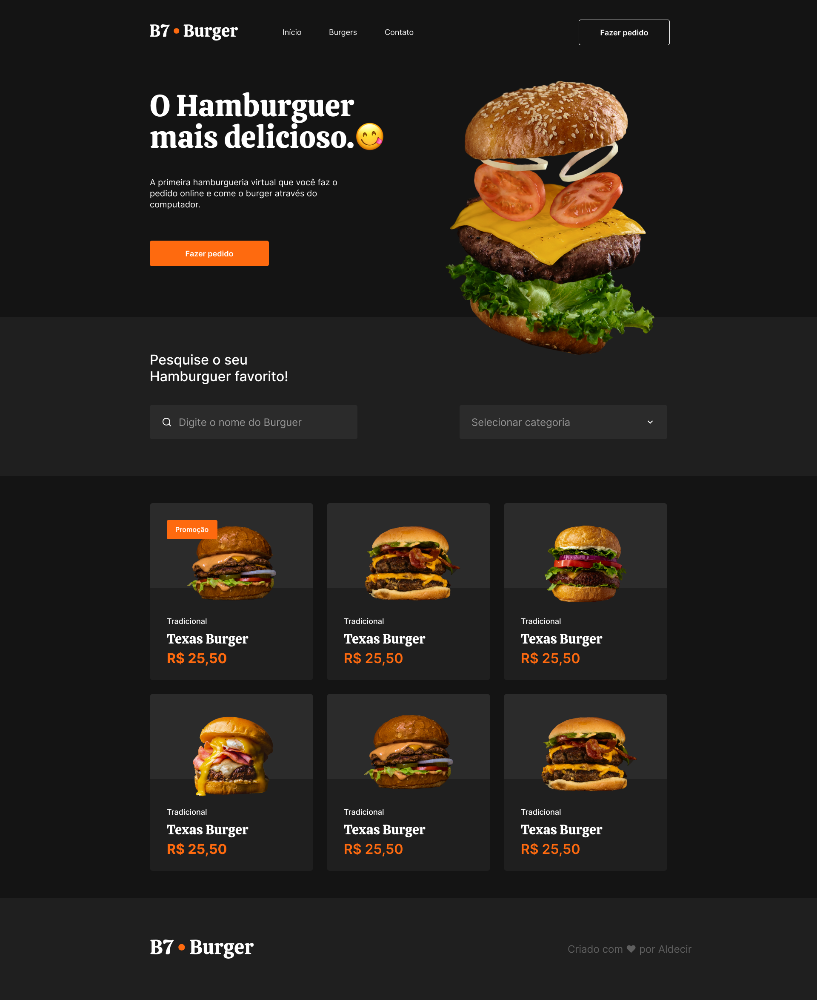
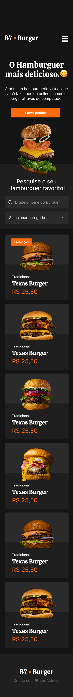

  

<h1 align="center">B7burger 🍔</h1>

  
  
  

  Uma hamburgueria virtual para explorar burgers deliciosos e fazer pedidos pelo computador! 😋

## 📋 Sobre o Projeto

B7burger é um site que simula uma hamburgueria virtual. Criado com HTML e CSS, um design atraente e responsivo, com menu, filtros por categoria e cardápio. Criado com intuito de treinar as habilidades de front-end e curtir um projeto cheio de criatividade! 🍔

## 🚀 Tecnologias Utilizadas

- **HTML5**: Estrutura do site.
- **CSS3**: Estilização com Flexbox, Grid e responsividade.
- **Markdown**: Documentação do projeto.

## 🛠 Funcionalidades

- Menu de navegação com links para início, burgueria e contato.
- Seção hero com imagem atraente e botão

## 📸 WEB

  

## 📸 Mobile

  

##  Tecnologias:

As seguintes ferramentas foram usadas na construção do projeto:

- HTML

- CSS

👨‍💻 Autor
Criado com ❤️ por Aldecir.

Conecte-se comigo:

 